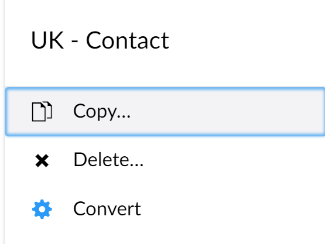
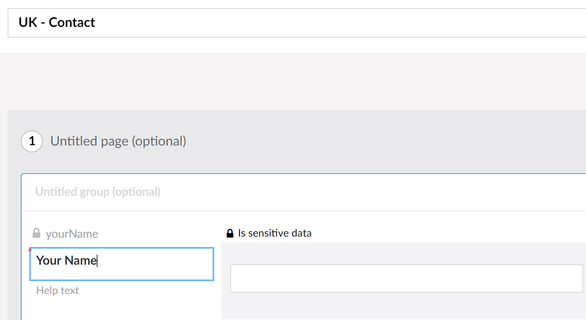
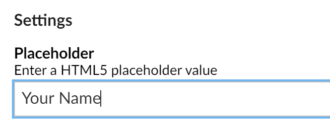
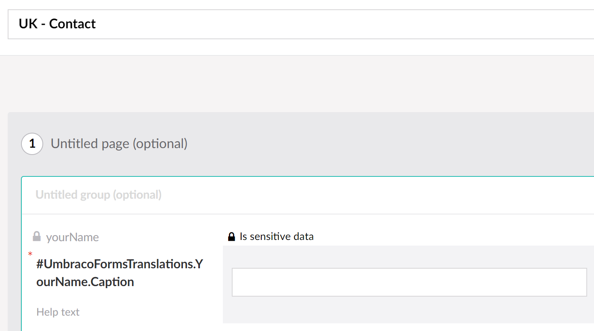
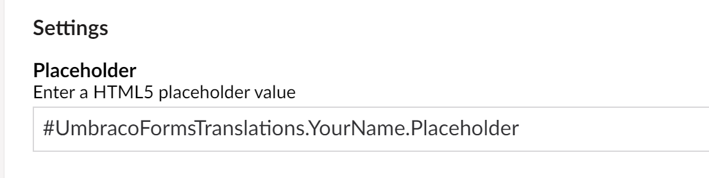
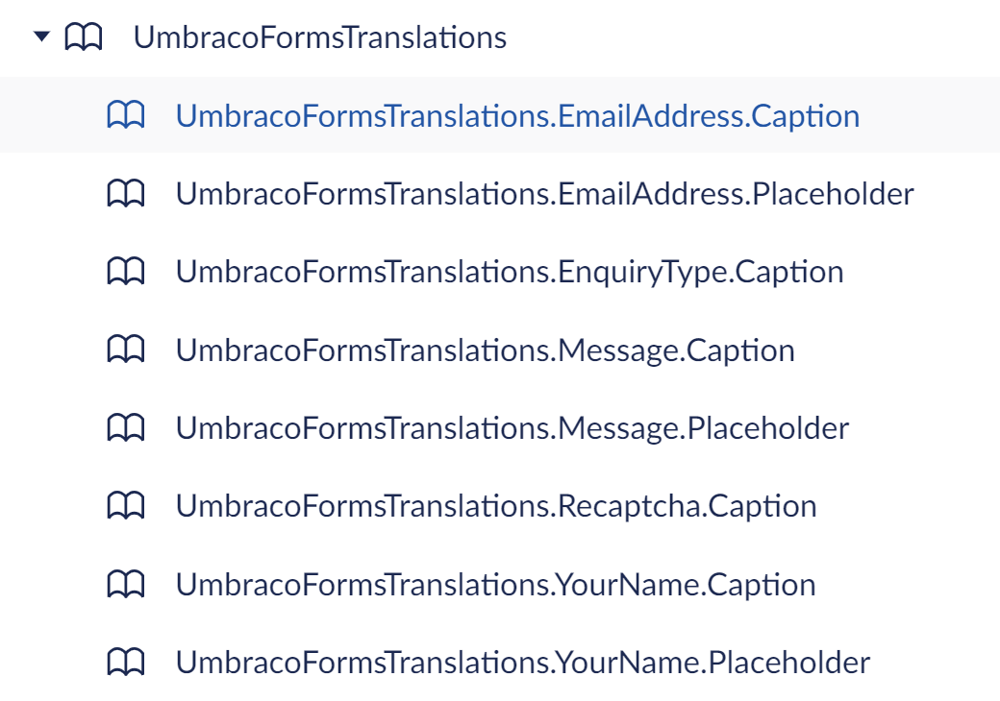
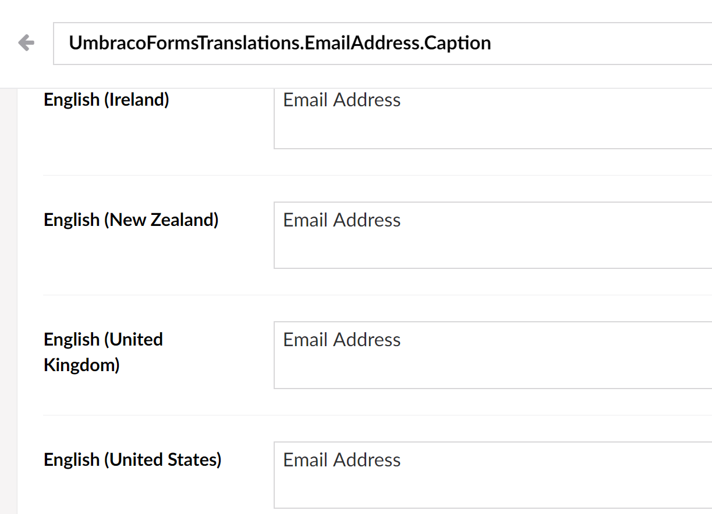

# CarbonSixDigital UmbracoForms Translations
An Umbraco Forms field translation generator

This package will allow you to convert an existing Umbraco Form to dictionary items. It will switch the existing fields to dictionary items, using the hash prefix. 

Only fields populated will be converted. 

Only the following field properties are converted: 

- Caption
- ToolTip
- Placeholder
- Default Value
- Invalid Error Message
- Required Error Message

# Nuget
`Install-Package CarbonSixDigital.UmbracoFormsTranslations`

# Screenshots

## Umbraco Form Action

## Fields before conversion

## Fields after conversion

## Translations

# Dependencies
~~~
Flurl 2.8.2
Flurl.Http 2.4.2
Humanizer.Core 2.8.26
UmbracoCms.Core 8.11.1
UmbracoCms.Web 8.11.1
UmbracoForms.Core 8.6.0
~~~

# Contact
[carbonsix.digital](https://carbonsix.digital/contact-us/)

# License
Licensed under the MIT License
